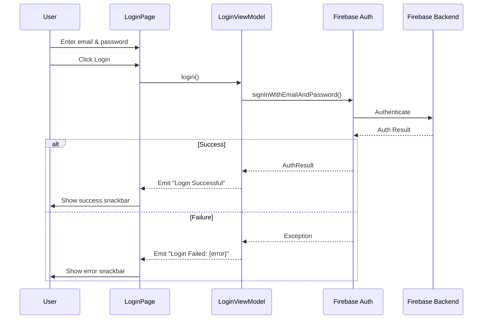

# Firebase Authentication Integration Documentation

## Overview

This document outlines the Firebase Authentication integration in the Kotlin Multiplatform Chat App.
The project uses Firebase Auth for user authentication with a multiplatform approach, allowing code
sharing between Android and iOS.

## Architecture

### Technology Stack

- **Kotlin Multiplatform**: Shared business logic across platforms
- **Jetpack Compose Multiplatform**: UI framework
- **Firebase Auth**: Authentication backend
- **GitLive Firebase SDK**: Multiplatform Firebase wrapper (v2.2.0)
- **Google Firebase SDK**: Native Android Firebase SDK
- **Navigation Compose**: Screen navigation

### Project Structure

```
KotlinChatApp/
├── composeApp/
│   ├── src/
│   │   ├── androidMain/
│   │   │   └── kotlin/org/example/project/
│   │   │       └── MainActivity.kt
│   │   └── commonMain/
│   │       └── kotlin/org/example/project/
│   │           ├── App.kt
│   │           └── presentation/
│   │               ├── features/
│   │               │   └── login/
│   │               │       └── LoginPage.kt
│   │               └── navigation/
│   │                   ├── NavGraph.kt
│   │                   └── Screens.kt
│   ├── build.gradle.kts
│   └── google-services.json (required)
├── gradle/
│   └── libs.versions.toml
└── build.gradle.kts
```

---

## Implementation Details

### 1. Dependency Configuration

#### gradle/libs.versions.toml

Added Firebase-related dependencies and the Google Services plugin:

```toml
[versions]
gitlive-firebase-auth = "2.2.0"
firebase-analytics-ktx = "22.5.0"
firebase-auth-ktx = "23.1.0"
google-services = "4.4.2"

[libraries]
dev-gitlive-firebase-auth = { module = "dev.gitlive:firebase-auth", version.ref = "gitlive-firebase-auth" }
firebase-analytics-ktx = { module = "com.google.firebase:firebase-analytics-ktx", version.ref = "firebase-analytics-ktx" }
firebase-auth-ktx = { module = "com.google.firebase:firebase-auth-ktx", version.ref = "firebase-auth-ktx" }

[plugins]
googleServices = { id = "com.google.gms.google-services", version.ref = "google-services" }
```

**Key Dependencies:**

- `dev.gitlive:firebase-auth`: Multiplatform Firebase Auth wrapper for common code
- `firebase-auth-ktx`: Native Android Firebase Auth SDK
- `firebase-analytics-ktx`: Firebase Analytics for Android
- `google-services`: Gradle plugin to process `google-services.json`

#### composeApp/build.gradle.kts

Applied the Google Services plugin and configured dependencies:

```kotlin
plugins {
    alias(libs.plugins.kotlinMultiplatform)
    alias(libs.plugins.androidApplication)
    alias(libs.plugins.composeMultiplatform)
    alias(libs.plugins.composeCompiler)
    alias(libs.plugins.googleServices)  // ✅ Added
}

kotlin {
    sourceSets {
        androidMain.dependencies {
            implementation(compose.preview)
            implementation(libs.androidx.activity.compose)
            implementation(libs.firebase.analytics.ktx)  // Android-specific
            implementation(libs.firebase.auth.ktx)       // Android-specific
        }
        commonMain.dependencies {
            implementation(compose.runtime)
            implementation(compose.foundation)
            implementation(compose.material3)
            implementation(compose.ui)
            implementation(compose.components.resources)
            implementation(compose.components.uiToolingPreview)
            implementation(libs.androidx.lifecycle.viewmodelCompose)
            implementation(libs.androidx.lifecycle.runtimeCompose)
            implementation(libs.androidx.navigation.compose)
            implementation(libs.dev.gitlive.firebase.auth)  // ✅ Multiplatform Firebase
        }
    }
}
```

**Dependency Strategy:**

- **commonMain**: Uses `dev.gitlive:firebase-auth` for shared code
- **androidMain**: Uses native Firebase SDK for platform-specific features

---

### 2. Firebase Initialization

#### MainActivity.kt (Android Entry Point)

```kotlin
package org.example.project

import android.os.Bundle
import androidx.activity.ComponentActivity
import androidx.activity.compose.setContent
import androidx.activity.enableEdgeToEdge
import androidx.compose.runtime.Composable
import androidx.compose.ui.tooling.preview.Preview

class MainActivity : ComponentActivity() {
    override fun onCreate(savedInstanceState: Bundle?) {
        enableEdgeToEdge()
        super.onCreate(savedInstanceState)
        setContent {
            App()
        }
    }
}
```

**Important Notes:**

- ❌ **No manual Firebase initialization required** - The Google Services plugin handles this
  automatically
- ✅ The plugin processes `google-services.json` and generates initialization code at build time
- ⚠️ Previously attempted manual initialization with `Firebase.initialize()` and
  `FirebaseApp.initializeApp()` caused conflicts

---

### 3. Navigation Setup

#### Screens.kt (Navigation Routes)

```kotlin
sealed class Screens(val route: String){
    data object Login : Screens("Login")
}
```

#### NavGraph.kt (Navigation Graph)

```kotlin
import androidx.compose.runtime.Composable
import androidx.navigation.NavHostController
import androidx.navigation.compose.NavHost
import androidx.navigation.compose.composable

@Composable
fun NavGraph(navController: NavHostController){
    NavHost(navController = navController, startDestination = Screens.Login.route) {
        composable(Screens.Login.route) {
            LoginPage()
        }
    }
}
```

#### App.kt (Root Composable)

```kotlin
package org.example.project

import NavGraph
import androidx.compose.material3.MaterialTheme
import androidx.compose.runtime.*
import androidx.navigation.compose.rememberNavController
import org.jetbrains.compose.ui.tooling.preview.Preview

@Composable
@Preview
fun App() {
    MaterialTheme {
        val navController = rememberNavController()
        NavGraph(navController)
    }
}
```

---

### 4. Authentication UI & Logic

#### LoginPage.kt (Complete Implementation)

```kotlin
import androidx.compose.foundation.background
import androidx.compose.foundation.layout.*
import androidx.compose.material3.*
import androidx.compose.runtime.*
import androidx.compose.ui.Alignment
import androidx.compose.ui.Modifier
import androidx.compose.ui.text.font.FontWeight
import androidx.compose.ui.unit.dp
import androidx.compose.ui.unit.sp
import androidx.lifecycle.ViewModel
import androidx.lifecycle.viewmodel.compose.viewModel
import dev.gitlive.firebase.Firebase
import dev.gitlive.firebase.auth.*
import kotlinx.coroutines.flow.MutableSharedFlow
import kotlinx.coroutines.flow.asSharedFlow
import kotlinx.coroutines.launch
import org.jetbrains.compose.ui.tooling.preview.Preview

@Preview
@Composable
fun LoginPage(){
    val viewModel = viewModel { LoginViewModel() }
    val scope = rememberCoroutineScope()
    val snackbarHostState = remember { SnackbarHostState() }
    
    LaunchedEffect(Unit) {
        viewModel.events.collect { event ->
            scope.launch {
                snackbarHostState.showSnackbar(event)
            }
        }
    }
    
    Scaffold(snackbarHost = { SnackbarHost(snackbarHostState) }) {
        Column(
            modifier = Modifier
                .background(MaterialTheme.colorScheme.primaryContainer)
                .safeContentPadding()
                .fillMaxSize(),
            horizontalAlignment = Alignment.CenterHorizontally,
            verticalArrangement = Arrangement.Center
        ) {
            Text("Login Page", fontSize = 36.sp, fontWeight = FontWeight.Bold)
            Spacer(modifier = Modifier.height(48.dp))
            
            Column {
                Text("Username")
                TextField(
                    value = viewModel.userName.value,
                    onValueChange = { newText -> viewModel.userName.value = newText },
                    label = { Text("Enter text") }
                )
                Spacer(modifier = Modifier.height(12.dp))
                
                Text("Password")
                TextField(
                    value = viewModel.password.value,
                    onValueChange = { newText -> viewModel.password.value = newText },
                    label = { Text("Enter text") }
                )
            }
            
            Spacer(modifier = Modifier.height(16.dp))
            Button(
                onClick = { scope.launch { viewModel.login() } }, 
                modifier = Modifier.padding(12.dp)
            ) {
                Text("Login", modifier = Modifier.padding(horizontal = 12.dp))
            }
            
            Text("username : ${viewModel.userName.value}")
            Text("password : ${viewModel.password.value}")
        }
    }
}

class LoginViewModel : ViewModel() {
    private val _events = MutableSharedFlow<String>()
    val events = _events.asSharedFlow()
    
    var userName = mutableStateOf("")
    var password = mutableStateOf("")
    
    suspend fun login(){
        _events.emit("Login - UserName: ${userName.value}, Password: ${password.value}")
        try {
            val auth = Firebase.auth
            auth.signInWithEmailAndPassword(userName.value, password.value)
            _events.emit("Login Successful")
        } catch (e: Exception) {
            _events.emit("Login Failed: ${e.message}")
        }
    }
}
```

**Architecture Pattern:**

- **MVVM (Model-View-ViewModel)** pattern
- **Unidirectional data flow** with events
- **Kotlin Flows** for reactive state management
- **Composable UI** with Material 3 design

**Key Components:**

1. **LoginViewModel**: Manages authentication state and business logic
2. **Event System**: Uses `SharedFlow` for one-time events (login success/failure)
3. **Snackbar**: Displays user feedback
4. **Firebase Auth**: `Firebase.auth.signInWithEmailAndPassword()`

---

## Setup Instructions

### Prerequisites

1. **Firebase Project**: Create a project
   at [Firebase Console](https://console.firebase.google.com/)
2. **Android App Registration**: Register your Android app with package name `org.example.project`

### Step-by-Step Setup

#### 1. Download google-services.json

1. Go to Firebase Console → Project Settings
2. Select your Android app
3. Download `google-services.json`
4. Place it in: `composeApp/google-services.json`

```
KotlinChatApp/
└── composeApp/
    ├── build.gradle.kts
    └── google-services.json  ← Place here
```

#### 2. Enable Firebase Authentication

1. In Firebase Console, navigate to **Authentication**
2. Click **Get Started**
3. Enable **Email/Password** authentication method
4. (Optional) Add test users for development

#### 3. Sync Gradle

```bash
./gradlew clean build
```

#### 4. Run the App

```bash
./gradlew :composeApp:installDebug
```

---

## Authentication Flow



---

## Features Implemented

### ✅ Current Features

1. **Email/Password Authentication**
    - User login with email and password
    - Firebase backend validation
    - Error handling with user feedback

2. **UI/UX**
    - Material 3 design system
    - Responsive layout with safe content padding
    - Real-time input validation display
    - Snackbar notifications for user feedback

3. **State Management**
    - ViewModel for business logic
    - Reactive state with Compose State
    - Event-driven architecture with Flows

4. **Multiplatform Architecture**
    - Shared authentication logic in `commonMain`
    - Platform-specific implementations in `androidMain`/`iosMain`

### 🚧 Future Enhancements

1. **Additional Auth Methods**
    - Google Sign-In
    - Facebook Login
    - Phone Number Authentication
    - Anonymous Authentication

2. **User Management**
    - User registration/sign-up
    - Password reset
    - Email verification
    - Profile management

3. **Security**
    - Password visibility toggle
    - Input validation
    - Rate limiting
    - Biometric authentication

4. **Session Management**
    - Remember me functionality
    - Auto-login
    - Token refresh
    - Logout functionality

---

## Troubleshooting

### Common Issues

#### 1. "Default FirebaseApp is not initialized"

**Cause**: Missing or incorrectly placed `google-services.json`

**Solution**:

- Ensure `google-services.json` is in `composeApp/` directory
- Verify Google Services plugin is applied in `build.gradle.kts`
- Clean and rebuild: `./gradlew clean build`

#### 2. Build Fails with Google Services Plugin

**Cause**: Version incompatibility or missing dependencies

**Solution**:

```kotlin
// Verify these versions in libs.versions.toml
google-services = "4.4.2"
firebase-auth-ktx = "23.1.0"
```

#### 3. Firebase Auth Not Working in Release Build

**Cause**: ProGuard/R8 rules not configured

**Solution**: Add ProGuard rules for Firebase (if minification is enabled)

#### 4. Import Resolution Errors

**Cause**: Gradle sync issues or missing dependencies

**Solution**:

- File → Invalidate Caches / Restart
- Delete `.gradle` and `.idea` folders
- Run `./gradlew clean build --refresh-dependencies`

---

## Security Best Practices

### ✅ Implemented

1. **No Hardcoded Credentials**: All Firebase config in `google-services.json`
2. **HTTPS by Default**: Firebase SDK uses secure connections
3. **Error Handling**: Catches and displays Firebase exceptions

### ⚠️ Recommendations

1. **Never commit `google-services.json` to public repos** (add to `.gitignore`)
2. **Use Firebase Security Rules** to restrict database access
3. **Enable App Check** to prevent API abuse
4. **Implement rate limiting** on authentication attempts
5. **Use strong password requirements** in Firebase Console
6. **Enable multi-factor authentication** for sensitive operations

---

## Testing

### Manual Testing Checklist

- [ ] Valid login credentials authenticate successfully
- [ ] Invalid credentials show appropriate error message
- [ ] Empty fields are handled gracefully
- [ ] Network errors display user-friendly messages
- [ ] Snackbar messages are clear and actionable
- [ ] UI is responsive and accessible

### Test User Creation

Create test users in Firebase Console:

1. Firebase Console → Authentication → Users
2. Click **Add User**
3. Enter email and password
4. Use these credentials for testing

---

## API Reference

### Firebase Auth Methods (GitLive SDK)

```kotlin
import dev.gitlive.firebase.Firebase
import dev.gitlive.firebase.auth.*

// Get auth instance
val auth = Firebase.auth

// Sign in with email/password
auth.signInWithEmailAndPassword(email: String, password: String): AuthResult

// Sign out
auth.signOut()

// Get current user
auth.currentUser: FirebaseUser?

// Create user
auth.createUserWithEmailAndPassword(email: String, password: String): AuthResult
```

### ViewModel Events

```kotlin
// Listen to authentication events
viewModel.events.collect { event ->
    // event: String (e.g., "Login Successful", "Login Failed: {error}")
}
```

---

## Dependencies Overview

| Dependency | Version | Purpose | Scope |
|------------|---------|---------|-------|
| `dev.gitlive:firebase-auth` | 2.2.0 | Multiplatform Firebase Auth | commonMain |
| `firebase-auth-ktx` | 23.1.0 | Native Android Firebase Auth | androidMain |
| `firebase-analytics-ktx` | 22.5.0 | Firebase Analytics | androidMain |
| `navigation-compose` | 2.8.0-alpha08 | Navigation framework | commonMain |
| `lifecycle-viewmodel-compose` | 2.9.5 | ViewModel integration | commonMain |
| `google-services` | 4.4.2 | Firebase config processing | Plugin |

---

## Resources

### Official Documentation

- [Firebase Auth Documentation](https://firebase.google.com/docs/auth)
- [GitLive Firebase SDK](https://github.com/GitLiveApp/firebase-kotlin-sdk)
- [Kotlin Multiplatform](https://kotlinlang.org/docs/multiplatform.html)
- [Jetpack Compose](https://developer.android.com/jetpack/compose)

### Project Files

- **Main Entry**: `composeApp/src/androidMain/kotlin/org/example/project/MainActivity.kt`
- **Login UI**:
  `composeApp/src/commonMain/kotlin/org/example/project/presentation/features/login/LoginPage.kt`
- **Navigation**:
  `composeApp/src/commonMain/kotlin/org/example/project/presentation/navigation/NavGraph.kt`
- **Dependencies**: `gradle/libs.versions.toml`

---

## Changelog

### Version 1.0 - Initial Implementation

**Added:**

- Firebase Authentication integration
- Email/password login functionality
- Login UI with Material 3
- Navigation setup with Compose Navigation
- Event-driven architecture with ViewModel
- Error handling and user feedback
- Google Services plugin configuration

**Fixed:**

- Firebase initialization conflict (removed manual initialization)
- Google Services plugin integration
- Dependency conflicts between GitLive and native Firebase SDK

**Configuration:**

- Minimum SDK: 24
- Target SDK: 36
- Compile SDK: 36
- Kotlin: 2.2.20
- Compose Multiplatform: 1.9.1

---

## Contributing

When extending authentication features:

1. Keep common logic in `commonMain`
2. Use platform-specific code only when necessary
3. Follow MVVM architecture pattern
4. Implement proper error handling
5. Add user feedback mechanisms
6. Update this documentation

---

## License

This project is part of the KotlinChatApp. Refer to the main project LICENSE file.

---

## Contact & Support

For issues or questions:

- Review Firebase Console for auth-related errors
- Check Android Logcat for detailed error messages
- Verify `google-services.json` configuration
- Ensure Firebase Authentication is enabled in console

---

**Last Updated**: 2025-11-24
**Author**: Development Team
**Project**: KotlinChatApp
