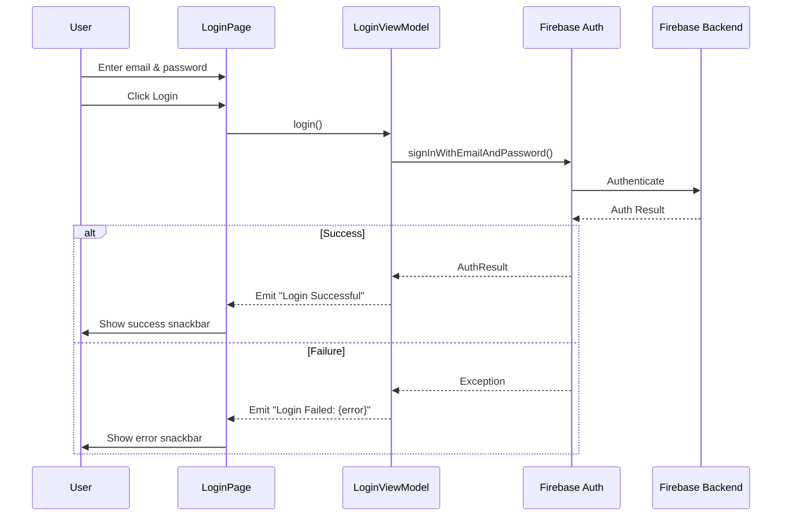
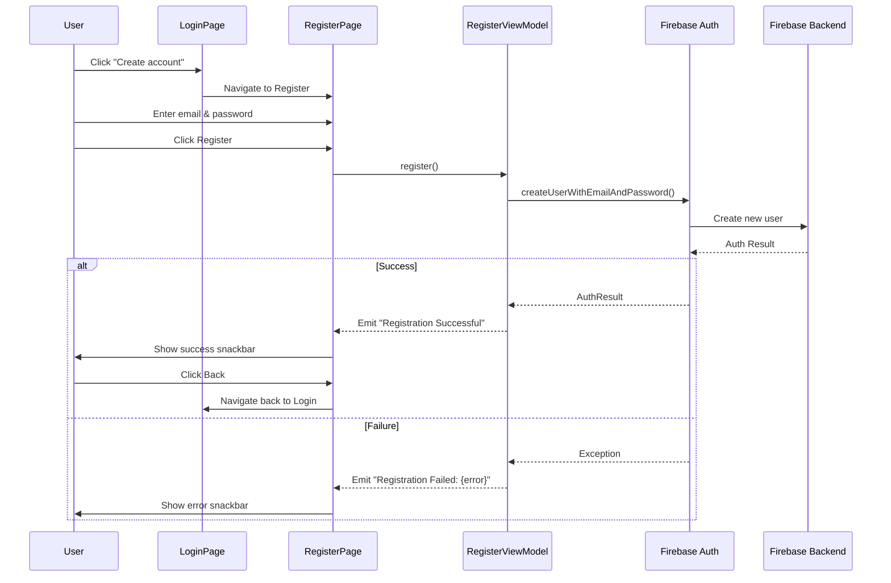

# Firebase Authentication Integration Documentation

## Overview

This document outlines the Firebase Authentication integration in the Kotlin Multiplatform Chat App.
The project uses Firebase Auth for user authentication with a multiplatform approach, allowing code
sharing between Android and iOS.

### What's Implemented

- ✅ **Email/Password Login** - Users can sign in with existing credentials
- ✅ **Email/Password Registration** - New users can create accounts
- ✅ **Navigation Flow** - Seamless navigation between Login and Register screens
- ✅ **Material 3 UI** - Modern, beautiful interface with Material Design
- ✅ **Error Handling** - Comprehensive error messages via Snackbar
- ✅ **MVVM Architecture** - Clean separation of concerns with ViewModels
- ✅ **Multiplatform Support** - Shared code across Android and iOS

### Key Technologies

- **Kotlin Multiplatform** for code sharing
- **Jetpack Compose Multiplatform** for UI
- **Firebase Authentication** for backend
- **GitLive Firebase SDK** for multiplatform Firebase support
- **Material Icons Extended** for UI icons
- **Navigation Compose** for screen navigation

## Architecture

### Technology Stack

- **Kotlin Multiplatform**: Shared business logic across platforms
- **Jetpack Compose Multiplatform**: UI framework
- **Firebase Auth**: Authentication backend
- **GitLive Firebase SDK**: Multiplatform Firebase wrapper (v2.2.0)
- **Google Firebase SDK**: Native Android Firebase SDK
- **Navigation Compose**: Screen navigation

### Project Structure

```
KotlinChatApp/
├── composeApp/
│   ├── src/
│   │   ├── androidMain/
│   │   │   └── kotlin/org/example/project/
│   │   │       └── MainActivity.kt
│   │   └── commonMain/
│   │       └── kotlin/org/example/project/
│   │           ├── App.kt
│   │           └── presentation/
│   │               ├── features/
│   │               │   ├── login/
│   │               │   │   └── LoginPage.kt
│   │               │   └── register/
│   │               │       └── RegisterPage.kt
│   │               └── navigation/
│   │                   ├── NavGraph.kt
│   │                   └── Screens.kt
│   ├── build.gradle.kts
│   └── google-services.json (required)
├── gradle/
│   └── libs.versions.toml
└── build.gradle.kts
```

---

## Implementation Details

### 1. Dependency Configuration

#### gradle/libs.versions.toml

Added Firebase-related dependencies and the Google Services plugin:

```toml
[versions]
gitlive-firebase-auth = "2.2.0"
firebase-analytics-ktx = "22.5.0"
firebase-auth-ktx = "23.1.0"
google-services = "4.4.2"

[libraries]
dev-gitlive-firebase-auth = { module = "dev.gitlive:firebase-auth", version.ref = "gitlive-firebase-auth" }
firebase-analytics-ktx = { module = "com.google.firebase:firebase-analytics-ktx", version.ref = "firebase-analytics-ktx" }
firebase-auth-ktx = { module = "com.google.firebase:firebase-auth-ktx", version.ref = "firebase-auth-ktx" }

[plugins]
googleServices = { id = "com.google.gms.google-services", version.ref = "google-services" }
```

**Key Dependencies:**

- `dev.gitlive:firebase-auth`: Multiplatform Firebase Auth wrapper for common code
- `firebase-auth-ktx`: Native Android Firebase Auth SDK
- `firebase-analytics-ktx`: Firebase Analytics for Android
- `google-services`: Gradle plugin to process `google-services.json`

#### composeApp/build.gradle.kts

Applied the Google Services plugin and configured dependencies:

```kotlin
plugins {
    alias(libs.plugins.kotlinMultiplatform)
    alias(libs.plugins.androidApplication)
    alias(libs.plugins.composeMultiplatform)
    alias(libs.plugins.composeCompiler)
    alias(libs.plugins.googleServices)  // ✅ Added
}

kotlin {
    sourceSets {
        androidMain.dependencies {
            implementation(compose.preview)
            implementation(libs.androidx.activity.compose)
            implementation(libs.firebase.analytics.ktx)  // Android-specific
            implementation(libs.firebase.auth.ktx)       // Android-specific
        }
        commonMain.dependencies {
            implementation(compose.runtime)
            implementation(compose.foundation)
            implementation(compose.material3)
            implementation(compose.ui)
            implementation(compose.components.resources)
            implementation(compose.components.uiToolingPreview)
            implementation(libs.androidx.lifecycle.viewmodelCompose)
            implementation(libs.androidx.lifecycle.runtimeCompose)
            implementation(libs.androidx.navigation.compose)
            implementation(libs.dev.gitlive.firebase.auth)  // ✅ Multiplatform Firebase
        }
    }
}
```

**Dependency Strategy:**

- **commonMain**: Uses `dev.gitlive:firebase-auth` for shared code
- **androidMain**: Uses native Firebase SDK for platform-specific features

---

### 2. Firebase Initialization

#### MainActivity.kt (Android Entry Point)

```kotlin
package org.example.kotlin_chat_app

import android.os.Bundle
import androidx.activity.ComponentActivity
import androidx.activity.compose.setContent
import androidx.activity.enableEdgeToEdge
import androidx.compose.runtime.Composable
import androidx.compose.ui.tooling.preview.Preview

class MainActivity : ComponentActivity() {
    override fun onCreate(savedInstanceState: Bundle?) {
        enableEdgeToEdge()
        super.onCreate(savedInstanceState)
        setContent {
            App()
        }
    }
}
```

**Important Notes:**

- ❌ **No manual Firebase initialization required** - The Google Services plugin handles this
  automatically
- ✅ The plugin processes `google-services.json` and generates initialization code at build time
- ⚠️ Previously attempted manual initialization with `Firebase.initialize()` and
  `FirebaseApp.initializeApp()` caused conflicts

---

### 3. Navigation Setup

#### Screens.kt (Navigation Routes)

```kotlin
sealed class Screens(val route: String){
    data object Login : Screens("Login")
    data object Register : Screens("Register")
}
```

#### NavGraph.kt (Navigation Graph)

```kotlin
import androidx.compose.runtime.Composable
import androidx.navigation.NavHostController
import androidx.navigation.compose.NavHost
import androidx.navigation.compose.composable

@Composable
fun NavGraph(navController: NavHostController){
    NavHost(navController = navController, startDestination = Screens.Login.route) {
        composable(Screens.Login.route) {
            LoginPage(createAccount = {
                navController.navigate(Screens.Register.route)
            })
        }
        composable(Screens.Register.route) {
            RegisterPage(onBack = {
                navController.popBackStack()
            })
        }
    }
}
```

**Navigation Features:**

- **Login to Register**: Navigation from login page to registration page
- **Back Navigation**: Users can return from registration to login
- **Type-safe routes**: Using sealed class for route management

#### App.kt (Root Composable)

```kotlin
package org.example.kotlin_chat_app

import NavGraph
import androidx.compose.material3.MaterialTheme
import androidx.compose.runtime.*
import androidx.navigation.compose.rememberNavController
import org.jetbrains.compose.ui.tooling.preview.Preview

@Composable
@Preview
fun App() {
    MaterialTheme {
        val navController = rememberNavController()
        NavGraph(navController)
    }
}
```

---

### 4. Authentication UI & Logic

#### LoginPage.kt (Login Implementation)

```kotlin
import androidx.compose.foundation.background
import androidx.compose.foundation.layout.*
import androidx.compose.material3.*
import androidx.compose.runtime.*
import androidx.compose.ui.Alignment
import androidx.compose.ui.Modifier
import androidx.compose.ui.text.font.FontWeight
import androidx.compose.ui.unit.dp
import androidx.compose.ui.unit.sp
import androidx.lifecycle.ViewModel
import androidx.lifecycle.viewmodel.compose.viewModel
import dev.gitlive.firebase.Firebase
import dev.gitlive.firebase.auth.*
import kotlinx.coroutines.flow.MutableSharedFlow
import kotlinx.coroutines.flow.asSharedFlow
import kotlinx.coroutines.launch
import org.jetbrains.compose.ui.tooling.preview.Preview

@Preview
@Composable
fun LoginPage(createAccount: () -> Unit) {
    val viewModel = viewModel { LoginViewModel() }
    val scope = rememberCoroutineScope()
    val snackbarHostState = remember { SnackbarHostState() }

    LaunchedEffect(Unit) {
        viewModel.events.collect { event ->
            scope.launch {
                snackbarHostState.showSnackbar(event)
            }
        }
    }

    Scaffold(snackbarHost = { SnackbarHost(snackbarHostState) }) {
        Column(
            modifier = Modifier
                .background(MaterialTheme.colorScheme.primaryContainer)
                .safeContentPadding()
                .fillMaxSize(),
            horizontalAlignment = Alignment.CenterHorizontally,
            verticalArrangement = Arrangement.Center
        ) {
            Text("Login Page", fontSize = 36.sp, fontWeight = FontWeight.Bold)
            Spacer(modifier = Modifier.height(48.dp))

            Column {
                Text("email")
                TextField(
                    value = viewModel.email.value,
                    onValueChange = { newText -> viewModel.email.value = newText },
                    label = { Text("Enter text") }
                )
                Spacer(modifier = Modifier.height(12.dp))

                Text("Password")
                TextField(
                    value = viewModel.password.value,
                    onValueChange = { newText -> viewModel.password.value = newText },
                    label = { Text("Enter text") }
                )
            }

            Spacer(modifier = Modifier.height(16.dp))
            Button(
                onClick = { scope.launch { viewModel.login() } },
                modifier = Modifier.padding(12.dp)
            ) {
                Text("Login", modifier = Modifier.padding(horizontal = 12.dp))
            }

            Text("email : ${viewModel.email.value}")
            Text("password : ${viewModel.password.value}")

            Button(
                onClick = createAccount,
                modifier = Modifier.padding(12.dp)
            ) {
                Text("Create account", modifier = Modifier.padding(horizontal = 12.dp))
            }
        }
    }
}

class LoginViewModel : ViewModel() {
    private val _events = MutableSharedFlow<String>()
    val events = _events.asSharedFlow()
    
    var email = mutableStateOf("")
    var password = mutableStateOf("")
    
    suspend fun login(){
        _events.emit("Login - email: ${email.value}, Password: ${password.value}")
        try {
            val auth = Firebase.auth
            auth.signInWithEmailAndPassword(email.value, password.value)
            _events.emit("Login Successful")
        } catch (e: Exception) {
            _events.emit("Login Failed: ${e.message}")
        }
    }
}
```

**Key Features:**

- Email/password input fields
- Login button with coroutine support
- "Create account" button for navigation to registration
- Real-time state display (for debugging)
- Error handling with snackbar notifications

#### RegisterPage.kt (Registration Implementation)

```kotlin
import androidx.compose.foundation.background
import androidx.compose.foundation.layout.*
import androidx.compose.material.icons.Icons
import androidx.compose.material.icons.filled.ArrowBack
import androidx.compose.material3.*
import androidx.compose.runtime.*
import androidx.compose.ui.Alignment
import androidx.compose.ui.Modifier
import androidx.compose.ui.text.font.FontWeight
import androidx.compose.ui.unit.dp
import androidx.compose.ui.unit.sp
import androidx.lifecycle.ViewModel
import androidx.lifecycle.viewmodel.compose.viewModel
import dev.gitlive.firebase.Firebase
import dev.gitlive.firebase.auth.*
import kotlinx.coroutines.flow.MutableSharedFlow
import kotlinx.coroutines.flow.asSharedFlow
import kotlinx.coroutines.launch
import org.jetbrains.compose.ui.tooling.preview.Preview

@OptIn(ExperimentalMaterial3Api::class)
@Preview
@Composable
fun RegisterPage(onBack: () -> Unit){
    val viewModel = viewModel { RegisterViewModel() }
    val scope = rememberCoroutineScope()
    val snackbarHostState = remember { SnackbarHostState() }
    
    LaunchedEffect(Unit) {
        viewModel.events.collect { event ->
            scope.launch {
                snackbarHostState.showSnackbar(event)
            }
        }
    }
    
    Scaffold(
        snackbarHost = { SnackbarHost(snackbarHostState) },
        topBar = {
            TopAppBar(
                title = { Text("Register") },
                navigationIcon = {
                    IconButton(onClick = onBack) {
                        Icon(
                            imageVector = Icons.Default.ArrowBack,
                            contentDescription = "Back"
                        )
                    }
                }
            )
        }
    ) {
        Column(
            modifier = Modifier
                .background(MaterialTheme.colorScheme.primaryContainer)
                .safeContentPadding()
                .fillMaxSize(),
            horizontalAlignment = Alignment.CenterHorizontally,
            verticalArrangement = Arrangement.Center
        ) {
            Text("Register Page", fontSize = 36.sp, fontWeight = FontWeight.Bold)
            Spacer(modifier = Modifier.height(48.dp))
            
            Column {
                Text("email")
                TextField(
                    value = viewModel.email.value,
                    onValueChange = { newText -> viewModel.email.value = newText },
                    label = { Text("Enter text") }
                )
                Spacer(modifier = Modifier.height(12.dp))
                
                Text("Password")
                TextField(
                    value = viewModel.password.value,
                    onValueChange = { newText -> viewModel.password.value = newText },
                    label = { Text("Enter text") }
                )
            }
            
            Spacer(modifier = Modifier.height(16.dp))
            Button(
                onClick = { scope.launch { viewModel.register() } },
                modifier = Modifier.padding(12.dp)
            ) {
                Text("Register", modifier = Modifier.padding(horizontal = 12.dp))
            }
            
            Text("email : ${viewModel.email.value}")
            Text("password : ${viewModel.password.value}")
        }
    }
}

class RegisterViewModel : ViewModel() {
    private val _events = MutableSharedFlow<String>()
    val events = _events.asSharedFlow()
    
    var email = mutableStateOf("")
    var password = mutableStateOf("")
    
    suspend fun register(){
        _events.emit("Register - email: ${email.value}, Password: ${password.value}")
        try {
            val auth = Firebase.auth
            auth.createUserWithEmailAndPassword(email.value, password.value)
            _events.emit("Registration Successful")
        } catch (e: Exception) {
            _events.emit("Registration Failed: ${e.message}")
        }
    }
}
```

**Key Features:**

- TopAppBar with back navigation
- Material Icons integration (ArrowBack icon)
- Email/password input fields
- Register button with coroutine support
- Error handling with snackbar notifications
- Uses `createUserWithEmailAndPassword()` for Firebase registration

**Architecture Pattern:**

- **MVVM (Model-View-ViewModel)** pattern
- **Unidirectional data flow** with events
- **Kotlin Flows** for reactive state management
- **Composable UI** with Material 3 design

**Key Components:**

1. **LoginViewModel & RegisterViewModel**: Manage authentication state and business logic
2. **Event System**: Uses `SharedFlow` for one-time events (login/register success/failure)
3. **Snackbar**: Displays user feedback
4. **Firebase Auth Methods**:
    - `Firebase.auth.signInWithEmailAndPassword()` for login
    - `Firebase.auth.createUserWithEmailAndPassword()` for registration

---

## Quick Start Usage

### User Registration Flow

1. **Launch App** - App opens on Login screen
2. **Navigate to Register** - User clicks "Create account" button
3. **Enter Details** - User enters email and password on Register screen
4. **Submit Registration** - User clicks "Register" button
5. **Account Created** - Firebase creates account and shows success message
6. **Return to Login** - User clicks back arrow to return to Login screen
7. **Login** - User can now login with newly created credentials

### User Login Flow

1. **Launch App** - App opens on Login screen
2. **Enter Credentials** - User enters registered email and password
3. **Submit Login** - User clicks "Login" button
4. **Authentication** - Firebase validates credentials
5. **Success** - User is authenticated (success message shown via snackbar)

### Code Usage Examples

#### Programmatically Login a User

```kotlin
val auth = Firebase.auth
try {
    val result = auth.signInWithEmailAndPassword("user@example.com", "password123")
    println("Logged in user: ${result.user?.email}")
} catch (e: Exception) {
    println("Login failed: ${e.message}")
}
```

#### Programmatically Register a User

```kotlin
val auth = Firebase.auth
try {
    val result = auth.createUserWithEmailAndPassword("newuser@example.com", "password123")
    println("Created user: ${result.user?.email}")
} catch (e: Exception) {
    println("Registration failed: ${e.message}")
}
```

#### Check Current User

```kotlin
val auth = Firebase.auth
val currentUser = auth.currentUser
if (currentUser != null) {
    println("User is logged in: ${currentUser.email}")
} else {
    println("No user logged in")
}
```

---

## Setup Instructions

### Prerequisites

1. **Firebase Project**: Create a project
   at [Firebase Console](https://console.firebase.google.com/)
2. **Android App Registration**: Register your Android app with package name `org.example.kotlin_chat_app`

### Step-by-Step Setup

#### 1. Download google-services.json

1. Go to Firebase Console → Project Settings
2. Select your Android app
3. Download `google-services.json`
4. Place it in: `composeApp/google-services.json`

```
KotlinChatApp/
└── composeApp/
    ├── build.gradle.kts
    └── google-services.json  ← Place here
```

#### 2. Enable Firebase Authentication

1. In Firebase Console, navigate to **Authentication**
2. Click **Get Started**
3. Enable **Email/Password** authentication method
4. (Optional) Add test users for development

#### 3. Sync Gradle

```bash
./gradlew clean build
```

#### 4. Run the App

```bash
./gradlew :composeApp:installDebug
```

---

## Authentication Flow

### Login Flow



### Registration Flow



---

## Features Implemented

### ✅ Current Features

1. **Email/Password Authentication**
    - User login with email and password
    - User registration with email and password
   - Firebase backend validation
   - Error handling with user feedback

2. **Navigation**
    - Login screen as entry point
    - Registration screen accessible from login
    - Back navigation from registration to login
    - Type-safe navigation with sealed classes

3. **UI/UX**
    - Material 3 design system
    - Responsive layout with safe content padding
    - TopAppBar with navigation controls
    - Material Icons Extended integration
    - Real-time input validation display
    - Snackbar notifications for user feedback

4. **State Management**
    - ViewModel for business logic (LoginViewModel & RegisterViewModel)
    - Reactive state with Compose State
    - Event-driven architecture with Flows
    - Separate ViewModels for separation of concerns

5. **Multiplatform Architecture**
    - Shared authentication logic in `commonMain`
    - Platform-specific implementations in `androidMain`/`iosMain`
    - Common UI components across platforms

### 🚧 Future Enhancements

1. **Additional Auth Methods**
    - Google Sign-In
    - Facebook Login
    - Phone Number Authentication
    - Anonymous Authentication

2. **Enhanced User Management**
    - Password reset/forgot password
    - Email verification
    - Profile management
    - User profile pictures
    - Account deletion

3. **Security & Validation**
    - Password visibility toggle
    - Email format validation
    - Password strength requirements
    - Confirm password field
    - Rate limiting
    - Biometric authentication

4. **Session Management**
    - Remember me functionality
    - Auto-login on app start
    - Token refresh
    - Logout functionality
    - Session timeout

5. **UI/UX Improvements**
    - Loading states during authentication
    - Automatic navigation after successful registration
    - Password requirements display
    - Form validation feedback
    - Keyboard type optimization (email keyboard for email field)

---

## Troubleshooting

### Common Issues

#### 1. "Default FirebaseApp is not initialized"

**Cause**: Missing or incorrectly placed `google-services.json`

**Solution**:

- Ensure `google-services.json` is in `composeApp/` directory
- Verify Google Services plugin is applied in `build.gradle.kts`
- Clean and rebuild: `./gradlew clean build`

#### 2. Build Fails with Google Services Plugin

**Cause**: Version incompatibility or missing dependencies

**Solution**:

```kotlin
// Verify these versions in libs.versions.toml
google-services = "4.4.2"
firebase-auth-ktx = "23.1.0"
```

#### 3. Firebase Auth Not Working in Release Build

**Cause**: ProGuard/R8 rules not configured

**Solution**: Add ProGuard rules for Firebase (if minification is enabled)

#### 4. Import Resolution Errors

**Cause**: Gradle sync issues or missing dependencies

**Solution**:

- File → Invalidate Caches / Restart
- Delete `.gradle` and `.idea` folders
- Run `./gradlew clean build --refresh-dependencies`

---

## Common Firebase Auth Errors

### Registration Errors

| Error Code              | Description                           | Solution                                 |
|-------------------------|---------------------------------------|------------------------------------------|
| `email-already-in-use`  | Email is already registered           | Ask user to login or use forgot password |
| `invalid-email`         | Email format is invalid               | Validate email format before submission  |
| `weak-password`         | Password is too weak (< 6 characters) | Enforce minimum 6 character password     |
| `operation-not-allowed` | Email/password auth not enabled       | Enable in Firebase Console               |

### Login Errors

| Error Code       | Description                    | Solution                              |
|------------------|--------------------------------|---------------------------------------|
| `invalid-email`  | Email format is invalid        | Validate email format                 |
| `user-disabled`  | User account has been disabled | Contact support                       |
| `user-not-found` | No user with this email        | Prompt user to register               |
| `wrong-password` | Incorrect password             | Allow user to retry or reset password |

### Network Errors

| Error Code               | Description              | Solution                                   |
|--------------------------|--------------------------|--------------------------------------------|
| `network-request-failed` | No internet connection   | Check network connectivity                 |
| `too-many-requests`      | Too many failed attempts | Implement rate limiting, wait before retry |

---

## Security Best Practices

### ✅ Implemented

1. **No Hardcoded Credentials**: All Firebase config in `google-services.json`
2. **HTTPS by Default**: Firebase SDK uses secure connections
3. **Error Handling**: Catches and displays Firebase exceptions

### ⚠️ Recommendations

1. **Never commit `google-services.json` to public repos** (add to `.gitignore`)
2. **Use Firebase Security Rules** to restrict database access
3. **Enable App Check** to prevent API abuse
4. **Implement rate limiting** on authentication attempts
5. **Use strong password requirements** in Firebase Console
6. **Enable multi-factor authentication** for sensitive operations

---

## Testing

### Manual Testing Checklist

#### Login Page Testing

- [ ] Valid login credentials authenticate successfully
- [ ] Invalid credentials show appropriate error message
- [ ] Empty fields are handled gracefully
- [ ] Network errors display user-friendly messages
- [ ] Snackbar messages are clear and actionable
- [ ] "Create account" button navigates to register page
- [ ] UI is responsive and accessible

#### Registration Page Testing

- [ ] New user registration creates account successfully
- [ ] Duplicate email shows appropriate error
- [ ] Weak password shows Firebase validation error
- [ ] Back button returns to login page
- [ ] TopAppBar displays correctly with back arrow
- [ ] Snackbar shows success/error messages
- [ ] Empty fields are handled gracefully

#### Navigation Testing

- [ ] Login to Register navigation works smoothly
- [ ] Back navigation from Register to Login works
- [ ] Navigation state is preserved correctly

### Test User Creation

Create test users in Firebase Console:

1. Firebase Console → Authentication → Users
2. Click **Add User**
3. Enter email and password
4. Use these credentials for testing

---

## API Reference

### Firebase Auth Methods (GitLive SDK)

```kotlin
import dev.gitlive.firebase.Firebase
import dev.gitlive.firebase.auth.*

// Get auth instance
val auth = Firebase.auth

// Sign in with email/password (Login)
auth.signInWithEmailAndPassword(email: String, password: String): AuthResult

// Create new user account (Registration)
auth.createUserWithEmailAndPassword(email: String, password: String): AuthResult

// Sign out
auth.signOut()

// Get current user
auth.currentUser: FirebaseUser?

// Update user profile
auth.currentUser?.updateProfile(displayName: String?, photoUrl: String?)

// Send password reset email
auth.sendPasswordResetEmail(email: String)

// Delete current user
auth.currentUser?.delete()
```

### ViewModel Events

#### LoginViewModel

```kotlin
// Listen to login events
loginViewModel.events.collect { event ->
    // event: String
    // Examples:
    // - "Login - email: user@example.com, Password: ******"
    // - "Login Successful"
    // - "Login Failed: The email address is badly formatted."
}
```

#### RegisterViewModel

```kotlin
// Listen to registration events
registerViewModel.events.collect { event ->
    // event: String
    // Examples:
    // - "Register - email: user@example.com, Password: ******"
    // - "Registration Successful"
    // - "Registration Failed: The email address is already in use."
}
```

### Navigation

```kotlin
// Navigate from Login to Register
navController.navigate(Screens.Register.route)

// Navigate back from Register to Login
navController.popBackStack()
```

---

## Dependencies Overview

| Dependency | Version | Purpose | Scope |
|------------|---------|---------|-------|
| `dev.gitlive:firebase-auth` | 2.2.0 | Multiplatform Firebase Auth | commonMain |
| `firebase-auth-ktx` | 23.1.0 | Native Android Firebase Auth | androidMain |
| `firebase-analytics-ktx` | 22.5.0 | Firebase Analytics | androidMain |
| `navigation-compose` | 2.8.0-alpha08 | Navigation framework | commonMain |
| `lifecycle-viewmodel-compose` | 2.9.5 | ViewModel integration | commonMain |
| `google-services` | 4.4.2 | Firebase config processing | Plugin |

---

## Resources

### Official Documentation

- [Firebase Auth Documentation](https://firebase.google.com/docs/auth)
- [GitLive Firebase SDK](https://github.com/GitLiveApp/firebase-kotlin-sdk)
- [Kotlin Multiplatform](https://kotlinlang.org/docs/multiplatform.html)
- [Jetpack Compose](https://developer.android.com/jetpack/compose)

### Project Files

- **Main Entry**: `composeApp/src/androidMain/kotlin/org/example/project/MainActivity.kt`
- **App Root**: `composeApp/src/commonMain/kotlin/org/example/project/App.kt`
- **Login UI**:
  `composeApp/src/commonMain/kotlin/org/example/project/presentation/features/login/LoginPage.kt`
- **Register UI**:
  `composeApp/src/commonMain/kotlin/org/example/project/presentation/features/register/RegisterPage.kt`
- **Navigation Graph**:
  `composeApp/src/commonMain/kotlin/org/example/project/presentation/navigation/NavGraph.kt`
- **Navigation Routes**:
  `composeApp/src/commonMain/kotlin/org/example/project/presentation/navigation/Screens.kt`
- **Dependencies**: `gradle/libs.versions.toml`
- **Build Config**: `composeApp/build.gradle.kts`

---

## Changelog

### Version 1.0 - Initial Implementation

**Added:**

- Firebase Authentication integration
- Email/password login functionality
- Email/password registration functionality
- Login UI with Material 3
- Registration UI with Material 3 and TopAppBar
- Navigation setup with Compose Navigation
- Login to Register navigation flow
- Material Icons Extended integration
- Event-driven architecture with ViewModel
- Separate ViewModels for Login and Register
- Error handling and user feedback
- Google Services plugin configuration

**Fixed:**

- Firebase initialization conflict (removed manual initialization)
- Google Services plugin integration
- Dependency conflicts between GitLive and native Firebase SDK

**Configuration:**

- Minimum SDK: 24
- Target SDK: 36
- Compile SDK: 36
- Kotlin: 2.2.20
- Compose Multiplatform: 1.9.1

**Dependencies:**

- GitLive Firebase Auth: 2.2.0
- Firebase Auth KTX: 23.1.0
- Firebase Analytics KTX: 22.5.0
- Google Services: 4.4.2
- Navigation Compose: 2.8.0-alpha08
- Material Icons Extended: Included

---

## Best Practices for Development

### Code Organization

1. **Keep common logic in `commonMain`** - All business logic and UI should be in commonMain when
   possible
2. **Use platform-specific code sparingly** - Only use androidMain/iosMain for platform-specific
   features
3. **Follow MVVM pattern** - ViewModels handle business logic, Composables handle UI
4. **Separate concerns** - One ViewModel per screen/feature
5. **Use sealed classes for navigation** - Type-safe route management

### Error Handling

1. **Always wrap Firebase calls in try-catch** - Firebase operations can throw exceptions
2. **Provide user-friendly error messages** - Parse Firebase exceptions and show readable messages
3. **Use Snackbar for feedback** - Consistent user feedback mechanism
4. **Log errors for debugging** - Use proper logging for production debugging

### UI/UX Guidelines

1. **Show loading states** - Indicate when authentication is in progress
2. **Disable buttons during operations** - Prevent multiple submissions
3. **Validate input before submission** - Client-side validation for better UX
4. **Use appropriate keyboard types** - Email keyboard for email fields
5. **Implement password visibility toggle** - Let users verify their password

### Security Considerations

1. **Never log sensitive data** - Don't log passwords or tokens
2. **Use HTTPS only** - Firebase SDK handles this by default
3. **Implement rate limiting** - Prevent brute force attacks
4. **Validate on both client and server** - Don't trust client-side validation alone
5. **Use strong password requirements** - Configure in Firebase Console

## Contributing

When extending authentication features:

1. Keep common logic in `commonMain`
2. Use platform-specific code only when necessary
3. Follow MVVM architecture pattern
4. Implement proper error handling
5. Add user feedback mechanisms
6. Update this documentation
7. Test on both Android and iOS platforms
8. Follow the established code style and patterns

---

## License

This project is part of the KotlinChatApp. Refer to the main project LICENSE file.

---

## Contact & Support

For issues or questions:

- Review Firebase Console for auth-related errors
- Check Android Logcat for detailed error messages
- Verify `google-services.json` configuration
- Ensure Firebase Authentication is enabled in console

---

## Summary

This Firebase Authentication integration provides a complete, production-ready authentication system
for the Kotlin Multiplatform Chat App. The implementation includes:

### Core Features

- **Login & Registration**: Full email/password authentication flow
- **Navigation**: Seamless navigation between authentication screens
- **Error Handling**: Comprehensive error management with user-friendly feedback
- **Modern UI**: Material 3 design with Material Icons Extended

### Architecture Highlights

- **MVVM Pattern**: Clean separation between UI and business logic
- **Multiplatform**: Shared code across Android and iOS
- **Event-Driven**: Reactive state management with Kotlin Flows
- **Type-Safe Navigation**: Using sealed classes for routes

### Key Files

- `LoginPage.kt` - Login UI and ViewModel
- `RegisterPage.kt` - Registration UI and ViewModel
- `NavGraph.kt` - Navigation configuration
- `Screens.kt` - Route definitions
- `MainActivity.kt` - Android entry point

### Next Steps

To extend this authentication system:

1. Add password reset functionality
2. Implement email verification
3. Add social login providers (Google, Facebook)
4. Create user profile management
5. Implement session persistence
6. Add loading states and form validation

For questions or issues, refer to the Troubleshooting section or check Firebase Console logs.

---

**Last Updated**: 2025-11-24  
**Author**: Development Team  
**Project**: KotlinChatApp  
**Version**: 1.0
